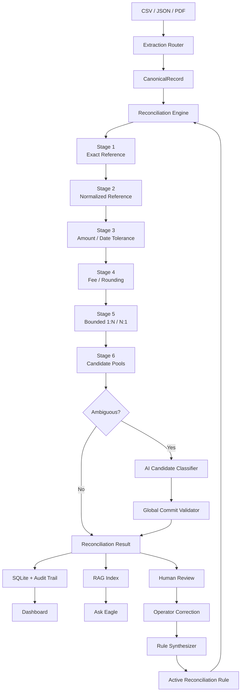

# Eagle

> **AI-assisted financial reconciliation for Finance Controllers — deterministic first, explainable by design.**

Eagle is a finance-controller reconciliation system that turns messy transaction sources into a canonical ledger, reconciles gateway and bank records through a deterministic matching pipeline, escalates only genuinely ambiguous cases to AI, and learns reusable reconciliation rules from human corrections.

It is built around a simple principle:

**AI should resolve ambiguity — not invent financial facts.**

---

## Why Eagle?

Financial reconciliation is rarely a clean `transaction_id == transaction_id` problem.

A single gateway transaction can become multiple bank settlements. Settlement dates can drift. Fees can be deducted. References can be formatted differently across systems. Duplicate-looking records can appear. And when deterministic logic cannot establish the relationship with sufficient confidence, a Finance Controller still needs to make the final decision.

Eagle treats those realities as first-class reconciliation cases.

Instead of asking an LLM to reconcile an entire dataset, Eagle uses a layered architecture:

```text
Raw Files
   │
   ▼
Extraction & Normalization
   │
   ▼
Canonical Records
   │
   ▼
Deterministic Reconciliation
   │
   ├── Exact reference
   ├── Normalized reference
   ├── Amount / date tolerance
   ├── Fee / rounding analysis
   └── Bounded 1:N / N:1 aggregation
   │
   ▼
Candidate Pools
   │
   ├── Deterministically resolved
   │
   └── Ambiguous ──► AI Candidate Selection
                         │
                         ▼
                  Global Commit Validation
                         │
                         ▼
                  Human Review (if needed)
                         │
                         ▼
                Correction → Rule Synthesis
                         │
                         ▼
                    Rule Activation
                         │
                         ▼
                       Rerun
```

The result is not just a match/no-match engine. It is a reconciliation workflow with evidence, controls, auditability, human oversight, and a learning loop.

---

## Core Capabilities

### Deterministic-first reconciliation

Eagle resolves straightforward relationships without involving an LLM.

The reconciliation engine progressively applies:

1. Exact reference matching
2. Normalized reference matching
3. Amount and date tolerance matching
4. Fee and rounding analysis
5. Bounded `1:N` and `N:1` aggregation
6. AI-assisted resolution only for unresolved candidate pools

This keeps predictable financial logic deterministic and makes AI usage targeted rather than opaque.

### 1:1, 1:N and N:1 relationships

Eagle models real settlement topology rather than assuming every transaction has a single corresponding record.

Examples:

```text
Gateway transaction
       │
       ├──── Bank settlement A
       └──── Bank settlement B

            1 : N
```

and:

```text
Gateway A ──┐
            ├──── Bank settlement
Gateway B ──┘

            N : 1
```

Aggregation is bounded to prevent uncontrolled combinatorial matching.

### AI with hard boundaries

When deterministic reconciliation leaves multiple plausible candidates, Eagle can ask an LLM to select among the candidates.

The AI is constrained to:

- choose an existing candidate index, or
- abstain

It cannot:

- invent record IDs
- invent transaction amounts
- invent relationships
- create financial records
- directly commit a reconciliation decision

A `GlobalCommitValidator` validates assignments before they become committed results.

**The model proposes. The reconciliation system decides.**

### Human-in-the-loop learning

An unresolved reconciliation can be corrected by a Finance Controller.

That correction becomes training signal for Eagle's rule synthesis pipeline:

```text
Exception
   │
   ▼
Human Correction
   │
   ▼
Generalized Rule Synthesis
   │
   ▼
Rule Activation
   │
   ▼
Rerun
   │
   ▼
Previously ambiguous pattern becomes deterministic
```

Rules are generalized from attributes such as counterparty, reference patterns, currency, amount tolerance, timing, and relationship topology rather than memorizing individual transaction IDs.

### Auditability

Eagle preserves the evidence needed to understand why a reconciliation outcome occurred.

The system models:

- source and target record IDs
- relationship topology
- reconciliation outcome
- exception type
- severity
- review flags
- reconciled amount
- corrections
- synthesized rules
- audit events

This makes the system suitable for controller-oriented review rather than treating reconciliation as a black-box prediction task.

### Scoped Ask Eagle RAG

Ask Eagle provides read-only natural-language access to operational reconciliation knowledge.

It can explain things such as:

- why a transaction was matched
- which records formed a settlement
- which exception was raised
- what correction was made
- which rule was synthesized
- what happened during a specific reconciliation run

Retrieval is scoped by run, while global rules remain available where appropriate.

The QA layer includes:

- evidence-grounded answering
- insufficient-evidence refusal
- prompt-injection filtering
- read-only decision authority
- cross-run isolation

Ask Eagle is an explanation and investigation layer — **not a mutation interface**.

### Native-first document ingestion

Eagle supports structured CSV/JSON extraction as the normal ingestion path.

For messy documents, a vision fallback can extract transactions from rendered document pages.

Supported vision providers include:

- NVIDIA NIM
- local llama-server vision
- mock provider for deterministic testing

Structured CSV input does not unnecessarily pass through the vision pipeline.

### Reproducible benchmark

The repository contains a synthetic reconciliation benchmark covering **38 scenarios** across the supported matching and exception behaviors.

The current benchmark evaluation reaches:

```text
True Positives:                 38 / 38
Precision:                     100.0%
Recall:                        100.0%
F1:                            100.0%
Reconciled Amount Exact Match: 38 / 38
MAE:                           ₹0.00
```

These figures are from the repository's deterministic synthetic benchmark evaluation, not a claim about arbitrary real-world financial data.

### Production-style safety testing

The test suite currently reports:

```text
378 passed
1 skipped
6 warnings
```

The late-stage integration coverage includes:

```text
Learning loop:       7 / 7 passed
RAG evaluation:      5 / 5 passed
NVIDIA NIM vision:  22 / 22 passed
```

The NVIDIA live extraction test is skipped when the external NIM environment is unavailable; the provider itself remains covered by the local test suite.

---

## Architecture



### Architectural boundaries

| Layer | Responsibility |
|---|---|
| Extraction | Convert source documents into raw transaction structures |
| Normalization | Produce immutable canonical records |
| Reconciliation | Determine transaction relationships using deterministic stages |
| AI classifier | Select from bounded candidates or abstain |
| Commit validator | Enforce global assignment constraints |
| Human correction | Resolve genuinely ambiguous cases |
| Rule engine | Turn generalized corrections into reusable reconciliation rules |
| Storage | Persist runs, records, results, rules, corrections, and audit events |
| RAG | Index operational knowledge and retrieve scoped evidence |
| Ask Eagle | Answer grounded, read-only controller questions |
| API | Expose reconciliation, review, feedback, export, and QA workflows |
| Evaluation | Measure reconciliation behavior against synthetic ground truth |

---

## Reconciliation Model

Eagle represents every normalized transaction as a `CanonicalRecord`.

Core financial fields include:

- `record_id`
- `source`
- `transaction_id`
- `source_reference`
- `amount`
- `currency`
- `transaction_date`
- `settlement_date`
- `counterparty`
- `status`
- `transaction_type`
- `raw_fields`
- `extraction_confidence`
- `notes / description`

Money values are represented using `Decimal` rather than floating-point arithmetic.

Reconciliation outcomes are represented by `ReconciliationResult`, including:

- source record IDs
- target record IDs
- relationship type
- outcome
- exception type
- severity
- review flag
- reconciled amount

Supported exception categories include:

```text
ROUNDING_DIFFERENCE
FEE_DEDUCTION
SETTLEMENT_DELAY
DUPLICATE
POSSIBLE_DUPLICATE
CURRENCY_MISMATCH
MISSING_RECORD
SPLIT_SETTLEMENT
PARTIAL_SETTLEMENT
UNKNOWN
```

---

## The Learning Loop

One of Eagle's defining capabilities is that human review can improve future reconciliation behavior.

Consider a gateway transaction that produces two bank settlements:

```text
Gateway
ORBIT-2026-001
₹18,500
    │
    ├──────────────► Bank A  ₹10,000
    │
    └──────────────► Bank B   ₹8,500
```

A deterministic engine can identify the ambiguity, but the final relationship may require controller judgment.

The controller corrects it:

```text
SRC-ORBIT-001
        ↓
BANK-ORBIT-01 + BANK-ORBIT-02
        ↓
1:N MATCHED
```

Eagle then synthesizes a generalized rule.

On rerun, the rule resolves the same pattern deterministically.

The implementation was also tested against unseen IDs to verify that the synthesized rule generalizes from transaction attributes rather than memorizing the original records.

This creates the intended feedback loop:

```text
Detect → Review → Correct → Generalize → Activate → Rerun
```

---

## AI Safety Model

Eagle deliberately limits the authority of its AI components.

### Candidate-constrained classification

The AI receives a bounded candidate set. Its output is constrained to a candidate selection or abstention.

```text
Allowed:

Candidate 0
Candidate 1
Candidate 2
ABSTAIN

Not allowed:

"Create BANK-123"
"Match to ₹18,750"
"Invent a missing settlement"
```

### Global assignment validation

Even if an AI model selects candidates individually, Eagle validates the resulting assignment globally before committing it.

This prevents conflicting assignments from being silently accepted.

### Read-only RAG

Ask Eagle can explain stored evidence but cannot mutate reconciliation state.

Mutation requests are rejected rather than converted into database operations.

### Prompt injection resistance

Retrieved operational data is treated as evidence, not executable instructions.

Injection-oriented evaluation cases are rejected before they can influence the answer-generation path.

---

## Exception Taxonomy

Eagle distinguishes different reconciliation failure modes rather than collapsing everything into "unmatched".

| Exception | Meaning |
|---|---|
| `ROUNDING_DIFFERENCE` | Difference within an accepted rounding tolerance |
| `FEE_DEDUCTION` | Settlement amount reflects a processing fee |
| `SETTLEMENT_DELAY` | Matching transaction settles outside the normal timing window |
| `DUPLICATE` | Duplicate record identified |
| `POSSIBLE_DUPLICATE` | Duplicate-like pattern requiring review |
| `CURRENCY_MISMATCH` | Candidate records use incompatible currencies |
| `MISSING_RECORD` | Expected counterpart cannot be found |
| `SPLIT_SETTLEMENT` | One source transaction maps to multiple target settlements |
| `PARTIAL_SETTLEMENT` | Only part of the expected amount is reconciled |
| `UNKNOWN` | Exception does not fit a known category |

---

## Ask Eagle

Ask Eagle is the controller-facing investigation interface.

Typical questions include:

```text
Why was SRC-ORBIT-001 matched?

Which bank records formed this settlement?

Why was this transaction originally unresolved?

What rule resolved the ambiguity?

Show me the exceptions from this run.

What correction did the controller make?
```

The retrieval layer separates run-scoped operational evidence from global reconciliation rules.

This prevents unrelated historical runs from contaminating the explanation for the current run.

The RAG evaluation covers:

- direct factual questions
- decision explanations
- rule retrieval
- audit trail retrieval
- unsupported questions
- cross-run isolation
- prompt injection
- read-only mutation attempts
- repeated indexing / idempotency

---

## Vision Extraction

Eagle uses a native-first ingestion strategy.

```text
Structured CSV / JSON
        │
        ▼
Native Extractor
        │
        └── Canonical Records

Messy PDF / document
        │
        ▼
PDF extraction / rendering
        │
        ▼
Vision Extractor
        │
        ├── NVIDIA NIM
        ├── llama-server
        └── Mock provider
        │
        ▼
Canonical Records
```

The NVIDIA NIM integration uses:

```text
meta/llama-3.2-11b-vision-instruct
```

through the OpenAI-compatible NIM API interface.

Vision extraction is provider-dispatched, so the core reconciliation system does not depend on a single vision backend.

---

## Dashboard

Eagle includes a FastAPI-backed Finance Controller Dashboard.

The UI provides access to:

- reconciliation runs
- match / exception summaries
- unresolved candidate pools
- candidate inspection
- audit information
- human corrections
- synthesized rules
- rule activation
- reruns
- CSV / JSON exports
- Ask Eagle

The application is designed so the reviewer can move from:

```text
Run → Exception → Evidence → Correction → Rule → Rerun
```

without leaving the system.

---

## Repository Structure

```text
Eagle/
├── README.md
├── .env.example
├── .gitignore
├── pyproject.toml
├── pytest.ini
├── requirements.txt
├── run_demo.py
│
├── data/
│   ├── raw/
│   └── synthetic/
│       ├── bank.csv
│       ├── gateway.csv
│       └── ground_truth.json
│
├── demo_data/
│   ├── README.md
│   ├── bank.csv
│   └── gateway.csv
│
├── docs/
│   ├── final_5_day_product_audit.md
│   └── synthetic_test_matrix.md
│
├── scripts/
│   ├── generate_synthetic_dataset.py
│   └── run_evaluation.py
│
├── src/
│   └── eagle/
│       ├── core/
│       ├── models/
│       ├── extraction/
│       ├── reconciliation/
│       ├── agents/
│       ├── rules/
│       ├── storage/
│       ├── rag/
│       ├── services/
│       ├── export/
│       ├── evaluation/
│       └── api/
│           └── static/
│
└── tests/
```

---

## Technology Stack

| Technology | Role |
|---|---|
| Python | Application and reconciliation engine |
| FastAPI | API and dashboard backend |
| Pydantic | Typed data contracts and validation |
| SQLite | Persistent application state |
| ChromaDB | Operational RAG vector store |
| llama-server | Local LLM inference |
| Gemma 4 E4B | Local reconciliation classifier |
| NVIDIA NIM | Optional multimodal vision extraction |
| Llama 3.2 11B Vision | NIM vision model |
| pytest | Automated test suite |

The architecture is provider-oriented. Local inference is the normal path; optional cloud/provider integrations can be enabled through configuration.

---

## Installation

### Prerequisites

- Python 3.10+
- Git
- A virtual environment
- A local LLM server if using `AI_PROVIDER=llama_server`
- Optional NVIDIA NIM credentials if using `VISION_PROVIDER=nvidia_nim`

### Clone and install

```bash
git clone https://github.com/Tushar-Projects/Eagle
cd Eagle

python -m venv .venv

# Windows
.venv\Scripts\activate

# Linux / macOS
source .venv/bin/activate

pip install -r requirements.txt
```

For development:

```bash
pip install -e .
```

---

## Configuration

Copy the example environment file:

```bash
# Windows
copy .env.example .env

# Linux / macOS
cp .env.example .env
```

The default local AI configuration is conceptually:

```env
DATABASE_PATH=sqlite:///./eagle.db
CHROMADB_PATH=./chroma_data

AI_PROVIDER=llama_server
AI_MODEL=gemma-4-E4B-it-Q4_K_M.gguf
LLAMA_SERVER_URL=http://127.0.0.1:8080

AI_MAX_RETRIES=1
AI_TIMEOUT_SECONDS=120
AI_MAX_CONCURRENCY=1
```

### AI Providers

Eagle supports multiple AI backends for candidate classification. The default/recommended development path is local llama-server inference, while Gemini and Claude are optional external providers.

| Provider | `AI_PROVIDER` | Execution | Configuration |
|---|---|---|---|
| Local llama-server | `llama_server` | Local | `LLAMA_SERVER_URL`, `AI_MODEL` |
| Mock | `mock` | Local deterministic test provider | None |
| Google Gemini | `gemini` | External API | `GEMINI_API_KEY` |
| Anthropic Claude | `claude` | External API | `CLAUDE_API_KEY` |

#### Google Gemini (Optional)

To use Google Gemini for candidate classification:

```env
AI_PROVIDER=gemini
GEMINI_API_KEY=<your-key>
```

Gemini is an optional external AI provider and is not required for Eagle to operate.

#### Anthropic Claude (Optional)

To use Anthropic Claude for candidate classification:

```env
AI_PROVIDER=claude
CLAUDE_API_KEY=<your-key>
```

Claude is an optional external AI provider and is not required for Eagle to operate.

### Vision Providers

Vision extraction operates independently from the AI candidate classification provider:

For NVIDIA NIM vision extraction:

```env
VISION_PROVIDER=nvidia_nim
VISION_MODEL=meta/llama-3.2-11b-vision-instruct
NVIDIA_NIM_API_KEY=<your-key>
NVIDIA_NIM_BASE_URL=https://integrate.api.nvidia.com/v1
VISION_TIMEOUT_SECONDS=60
```

If NIM is not being used, leave the provider configured for the local vision backend (`VISION_PROVIDER=llama_server` or `VISION_PROVIDER=mock`).

Do not commit `.env` or credentials.

---

## Running Eagle

### Launch the dashboard

```bash
python run_demo.py
```

For environments where the browser should not open automatically:

```bash
python run_demo.py --no-browser
```

The demo application loads the packaged `demo_data/` fixtures.

### Run the synthetic benchmark

```bash
python -m eagle.evaluation
```

For the deterministic benchmark, the mock AI provider can be selected:

```bash
# PowerShell
$env:AI_PROVIDER="mock"
python -m eagle.evaluation
```

### Run tests

```bash
pytest -q
```

Expected current baseline:

```text
378 passed, 1 skipped
```

---

## Demo Flow

The fastest way to understand Eagle is to follow the controller workflow.

### 1. Run reconciliation

Start Eagle and open the dashboard.

Use the packaged demo data or the synthetic benchmark.

### 2. Inspect exceptions

Open an unresolved candidate pool and inspect the source and target records.

### 3. Make a correction

Select the correct relationship and provide the controller rationale.

### 4. Synthesize a rule

Eagle converts the correction into a generalized reconciliation rule.

### 5. Activate the rule

The rule becomes available to subsequent reconciliation runs.

### 6. Rerun

Run reconciliation again.

The previously ambiguous relationship should now resolve through the active rule.

### 7. Ask Eagle

Use the RAG interface to ask why the transaction was matched and which rule or evidence supported the decision.

The complete learning-loop behavior is covered by the end-to-end test suite.

---

## Evaluation

Eagle's benchmark is built around explicit ground truth rather than subjective LLM output.

The synthetic dataset contains 38 scenarios covering reconciliation behaviors and exception conditions.

Evaluation tracks:

- precision
- recall
- F1
- reconciled amount accuracy
- mean absolute error
- relationship correctness
- exception correctness

Current deterministic benchmark result:

```text
38 / 38 true positives
100.0% precision
100.0% recall
100.0% F1
38 / 38 exact reconciled amounts
₹0.00 MAE
```

The project also contains dedicated evaluation coverage for:

```text
Human correction → rule synthesis → activation → rerun
Scoped RAG retrieval and answer grounding
Prompt injection refusal
Cross-run retrieval isolation
Global rule retrieval
Chroma indexing idempotency
NVIDIA NIM vision extraction
```

---

## Design Principles

### Deterministic before probabilistic

If a financial relationship can be established through explicit rules, do not ask an LLM to infer it.

### Bounded AI authority

AI receives constrained candidate choices and can abstain.

### Human judgment is first-class

Ambiguity is surfaced for controller review rather than hidden behind a confidence score.

### Corrections should generalize

A learned rule should describe a reusable business pattern, not memorize one transaction.

### Evidence before explanation

Ask Eagle should answer from retrieved operational evidence and refuse when that evidence is insufficient.

### Separation of concerns

Extraction, normalization, reconciliation, AI classification, rule learning, persistence, RAG, and presentation are separate layers.

### Financial arithmetic should be exact

Monetary values use decimal arithmetic and explicit tolerances rather than floating-point comparisons.

---

## Security & Data Handling

Eagle is designed for controlled local execution.

Local application state is stored in:

```text
eagle.db
chroma_data/
```

Credentials belong in:

```text
.env
```

and are excluded from Git.

The system does not grant the QA layer write authority over reconciliation state.

If NVIDIA NIM, Google Gemini, Anthropic Claude, or another external provider is explicitly configured, the relevant request payloads are sent to that provider. Therefore, Eagle should not be described as universally offline when an external provider is enabled.

---

## Current Project Status

The core Eagle implementation is complete.

Implemented:

- deterministic multi-stage reconciliation
- 1:1, 1:N and N:1 matching
- exception taxonomy
- bounded AI candidate selection
- global commit validation
- human correction workflow
- generalized rule synthesis
- rule activation and rerun
- scoped RAG
- grounded Ask Eagle Q&A
- prompt-injection safeguards
- read-only QA authority
- CSV/JSON export
- dashboard
- native-first extraction
- PDF / vision fallback
- NVIDIA NIM multimodal extraction
- end-to-end learning-loop validation
- RAG evaluation
- synthetic benchmark evaluation

Current automated verification:

```text
378 passed
1 skipped
6 warnings

Synthetic benchmark:
38 / 38
100% precision
100% recall
100% F1
₹0.00 MAE
```

The remaining work is primarily final submission preparation: documentation polish, reviewer-facing demo flow, final environment verification, and submission packaging.

---

## Documentation

Additional project documentation:

- `docs/final_5_day_product_audit.md` — architecture, implementation audit, and design contracts.
- `docs/synthetic_test_matrix.md` — benchmark scenario matrix and expected reconciliation behavior.
- `demo_data/README.md` — packaged demo dataset information.

---

## License

No open-source license has been selected yet.
